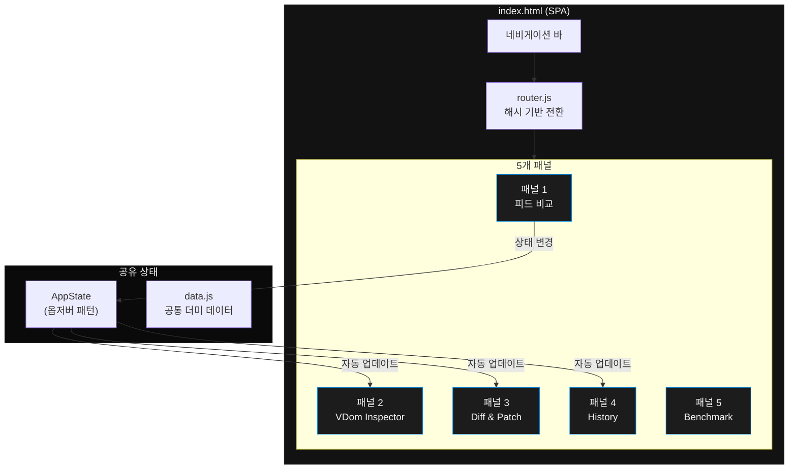
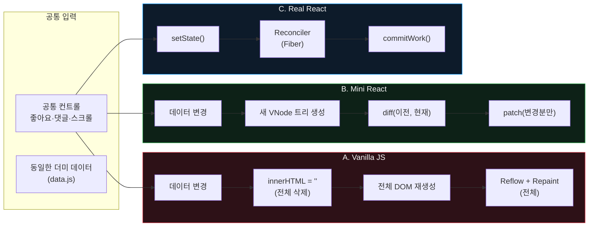
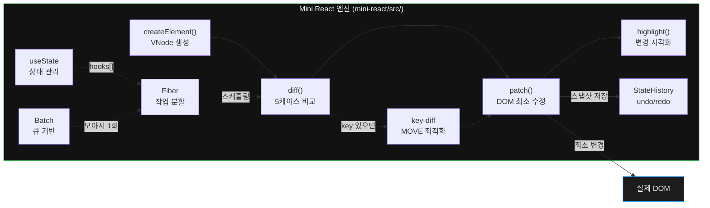
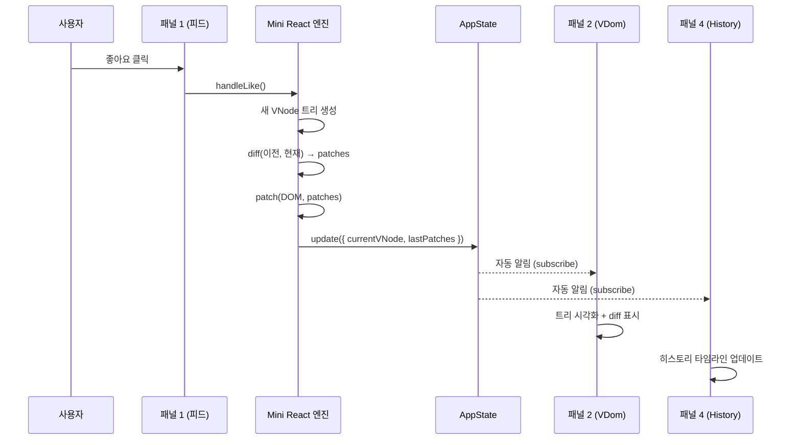

# Mini React — Instagram으로 배우는 Virtual DOM

> "인스타그램 좋아요 버튼은 어떻게 이렇게 빠를까요?"

React가 왜 필요한가를 **세 가지 버전**(Vanilla JS / Mini React / Real React)을 나란히 비교하며 실시간으로 증명하는 교육용 프로젝트입니다.

---

## 왜 만들었나요?

인스타그램에서 좋아요를 누르면 화면이 즉시 반응합니다. 하지만 Vanilla JS로 같은 기능을 만들면 데이터가 많아질수록 느려집니다. **왜?**

이 프로젝트는 그 "왜"에 대한 답을 **직접 구현**하며 찾아갑니다.

- Virtual DOM이 뭔지
- Diff 알고리즘이 어떻게 변경점을 찾는지
- Patch가 어떻게 최소한의 DOM만 건드리는지
- Fiber와 Batch가 왜 필요한지

그리고 이 모든 것이 **실제 React의 핵심과 동일**하다는 것을 구현 대응표로 증명합니다.

---

## 실행 방법

```bash
# 1. 메인 앱 서버 (포트 3000)
npx serve -l 3000

# 2. Real React 서버 (포트 3001) — 별도 터미널
cd real-react
npm install
npm run dev
```

브라우저에서 `http://localhost:3000` 접속

> Real React(C열)는 Vite dev 서버가 필요합니다. 서버가 꺼져 있으면 폴백 메시지가 표시됩니다.

---

## 앱 구조 — SPA, 5개 패널

```
index.html (단일 파일)
│
├── 네비게이션: [피드·비교] [VDom] [Diff·Patch] [History] [Benchmark]
│
├── 패널 1: 피드 비교          ← 세 버전 나란히 + 공통 컨트롤 + 배치 비교
├── 패널 2: VDom Inspector     ← 인터랙션 → VNode 트리 시각화
├── 패널 3: Diff & Patch 뷰어  ← HTML 수정 → diff → patch → 실제 반영
├── 패널 4: History 뷰어       ← 상태 히스토리 타임라인 + 시간여행
└── 패널 5: Benchmark          ← 성능 비교 + 구현 대응표
```

---

## 아키텍처

### 전체 시스템 구조



### 3버전 비교 구조 — 같은 데이터, 다른 렌더링



### Mini React 엔진 파이프라인



### 데이터 흐름 — 패널 간 통신



### Vanilla vs VDom — 인피니트 스크롤 문제


---

## Virtual DOM이 필요한 이유

```
[Vanilla JS]
데이터 변경 → 전체 innerHTML 교체 → 브라우저 Reflow + Repaint (전체)

[Virtual DOM]
데이터 변경 → 새 VNode 트리 생성 → Diff(이전 vs 현재) → 변경점만 Patch
→ 브라우저는 바뀐 부분만 다시 그림
```

**핵심**: DOM 조작은 비싸다. Virtual DOM은 "뭐가 바뀌었는지"를 먼저 파악해서 최소한만 건드린다.

---

## VDom이 무조건 빠를까? — 배치의 중요성

이 프로젝트의 핵심 발견:

```
[배치 없이 좋아요 1000회]
Vanilla:     ~488ms  (innerHTML 1000회)
Mini React:  ~650ms  (VNode 생성 + diff + patch 1000회)  ← 오히려 느림!

[배치 적용 좋아요 1000회]
Vanilla:     ~488ms  (여전히 innerHTML 1000회)
Mini React:  ~0.2ms  (상태 1000번 변경, diff + patch 1회)  ← 2440배 빠름!
```

**VDom 자체가 빠른 게 아니라, 배치(Batch)가 핵심입니다.**
이것이 React 18의 automatic batching과 같은 원리입니다.

---

## Diff 알고리즘 5케이스

두 트리를 완전히 비교하면 O(n³). 5가지 규칙으로 O(n)에 해결합니다.

| 케이스 | 설명 | 예시 |
|--------|------|------|
| CREATE | 새 노드 추가 | `null → <li>` |
| REMOVE | 기존 노드 삭제 | `<li> → null` |
| REPLACE | 태그 자체 변경 | `<p> → <span>` |
| TEXT | 텍스트만 변경 | `"127" → "128"` |
| PROPS | 속성만 변경 | `class="red" → "blue"` |

```js
// diff()가 반환하는 패치 객체
{
  type: 'TEXT',
  path: [3, 1, 0],  // 루트 → 4번째 자식 → 2번째 자식 → 1번째 자식
  oldText: '127',
  newText: '128',
}
```

---

## key 최적화

```
[key 없이 리스트 순서 변경]
[A, B, C] → [C, A, B]
→ A→C 교체, B→A 교체, C→B 교체 (TEXT 변경 3번)

[key 있을 때]
[A, B, C] → [C, A, B]
→ C를 맨 앞으로 이동 (MOVE 1번, DOM 재생성 없음)
```

---

## Fiber — 브라우저가 멈추지 않는 이유

```
[기존 방식]
Diff 시작 ──────────────────── Diff 끝
          (브라우저 멈춤)

[Fiber 방식]
작업 ── 양보 ── 작업 ── 양보 ── 작업 ── 끝
     (브라우저    (브라우저    (브라우저
      응답 가능)   응답 가능)   응답 가능)
```

`requestIdleCallback`: "브라우저야, 한가할 때 이거 해줘"

> EC-09: `requestIdleCallback` 미지원 시 `setTimeout(fn, 0)` 폴백 처리

---

## useState — 상태를 기억하는 방법

```js
// 함수는 실행될 때마다 변수가 사라져요
// useState는 Fiber의 hooks[] 배열에 저장해서 기억해요
const [count, setCount] = useState(0)

// hooks[] 배열:
// [{ value: 0 }, { value: 'Alice' }]
//       ↑               ↑
//   첫 번째 useState   두 번째 useState
```

순서로 구분하기 때문에 **조건문 안에 쓰면 안 됩니다** (EC-10).

---

## Batch — setState를 모아서 한 번에

```js
// setState 3번 호출 → 렌더링 몇 번?
setState(1)  // 큐에 쌓기만
setState(2)  // 큐에 쌓기만
setState(3)  // 큐에 쌓기만
// → 마이크로태스크에서 한 번에 처리 → 렌더링 1회!

// Vanilla: 3번 호출 → 3번 렌더링
// Mini React: 3번 호출 → 1번 렌더링 (Batch)
// Real React: 3번 호출 → 1번 렌더링 (React 18 automatic batching)
```

---

## 벤치마크 결과

| 측정 항목 | Vanilla | Mini React | Real React |
|-----------|---------|------------|------------|
| 좋아요 1000회 | ~488ms | ~0.2ms (배치) | ~0.2ms |
| 포스트 100개 렌더 | 비슷 | 비슷 | 비슷 |
| 인피니트 스크롤 +10개 | **멈춤** (아래 설명) | CREATE 10개만 | CREATE 10개만 |
| setState 3회 렌더 횟수 | 3회 | 1회 (배치) | 1회 (automatic batching) |

### Vanilla 인피니트 스크롤이 멈추는 이유 — Sentinel 문제

인피니트 스크롤은 **Intersection Observer**로 구현합니다. 피드 맨 아래에 보이지 않는 sentinel(감시 요소)을 두고, 이 요소가 화면에 들어오면 "바닥에 도달했다"고 판단해서 포스트를 추가합니다.

```
┌──────────────┐
│  포스트 1     │
│  포스트 2     │
│  ...         │
│  포스트 10    │
│  ── sentinel ── ← Observer가 감시하는 요소
└──────────────┘
         ↓ 스크롤해서 sentinel이 보이면
         ↓ Observer 발동 → 포스트 +10개 로드
```

**Vanilla의 문제:**
```
render() 호출
  → container.innerHTML = ''   ← 전체 DOM 삭제 (sentinel 포함!)
  → 새 DOM 생성               ← 새 sentinel도 생성되지만
  → Observer는 이전 sentinel을 감시 중  ← 연결 끊김!
```

Vanilla는 매번 `innerHTML`로 전체를 지우고 다시 그리기 때문에, Observer가 감시하던 sentinel DOM 요소가 삭제됩니다. 새로 만들어진 sentinel은 Observer에 등록되지 않았으므로 **인피니트 스크롤이 멈춥니다.**

**Mini React / Real React:**
```
smartRender() 호출
  → diff(이전 VNode, 새 VNode)  ← 변경점만 찾음
  → patch(변경된 부분만)         ← sentinel은 변경 없음 → DOM 그대로!
  → Observer는 같은 sentinel을 계속 감시  ← 정상 동작
```

VDom 방식은 변경되지 않은 노드를 건드리지 않으므로, sentinel DOM이 유지되고 Observer 연결이 끊어지지 않습니다.

**이것이 Virtual DOM이 필요한 실제 이유 중 하나입니다** — 단순한 속도 차이가 아니라, 전체 리렌더가 기존 DOM 참조(Observer, 이벤트, input 포커스 등)를 파괴하는 문제를 해결합니다.

> Real React 측정값에 `~`가 붙는 이유: iframe(postMessage) 비동기 통신 특성상 동기 측정이 불가하여, 배치 적용된 Mini React 실측값 기반으로 추정합니다.

### 벤치마크 패널에서 Vanilla가 더 빠르게 나올 수 있는 이유

벤치마크 패널(패널 5)의 "좋아요 1000회"와 "UI 블로킹" 측정은 **단순한 DOM 시뮬레이션**입니다.

- **Vanilla**: `innerHTML = 문자열` 한 줄 — 브라우저의 네이티브 HTML 파서가 처리
- **Mini React**: `createElement()` → `diff()` — JavaScript 객체 생성 + 트리 순회 오버헤드

DOM 구조가 단순할수록 innerHTML이 빠르고, VNode 객체 생성 + diff 함수 호출의 JS 오버헤드가 더 클 수 있습니다. 이것은 **정상적인 결과**입니다.

**VDom의 진짜 이점은 단순 속도가 아닙니다:**

1. **복잡한 DOM에서의 최소 업데이트** — 실제 피드처럼 수백 개 노드가 있을 때, innerHTML은 전체를 버리고 다시 만들지만 diff+patch는 변경된 1개만 건드림
2. **배치(Batch)** — 상태 변경 1000번을 모아서 렌더 1번만 실행
3. **입력 상태 보존** — innerHTML로 전체를 교체하면 input의 포커스/입력값이 날아가지만, patch는 변경되지 않은 노드를 그대로 유지

따라서 **피드 비교 패널(패널 1)의 배치 없음 vs 배치 적용 비교**가 VDom의 실제 가치를 더 정확하게 보여줍니다.

---

## 구현 대응표

| 우리 구현 | Real React 대응 | 역할 |
|-----------|----------------|------|
| `domToVNode()` | `React.createElement()` | DOM을 가상 객체로 변환 |
| `diff()` 5케이스 | Reconciler (`ReactFiber.js`) | 두 트리 비교, 변경점 추출 |
| `patch()` | `react-dom commitWork()` | 변경점을 실제 DOM에 반영 |
| `key-diff` | `key` prop 최적화 | 리스트 순서 변경 최적화 |
| Fiber 스케줄러 | `scheduler` 패키지 `workLoop` | 작업 분할, 브라우저 양보 |
| `useState` | `ReactHooks.js` | 함수 컴포넌트 상태 관리 |
| Batch (큐 기반) | React 18 automatic batching | 여러 setState를 모아서 한 번에 |

**"우리가 구현한 것이 React의 핵심입니다."**

---

## 파일 구조

```
project/
├── index.html                   # SPA 진입점
├── main.js                      # 앱 초기화 + 패널 로드
├── style.css                    # 전체 레이아웃 (Instagram 다크 테마)
│
├── shared/
│   ├── data.js                  # 3버전 공통 더미 데이터
│   ├── design-tokens.css        # CSS 변수 (색상, 폰트, 간격)
│   ├── app-state.js             # 패널 간 공유 상태 (옵저버 패턴)
│   ├── router.js                # 해시 기반 패널 전환
│   └── drag-scroll.js           # 스토리 바 드래그 스크롤
│
├── mini-react/src/              # Mini React 엔진 (직접 구현)
│   ├── vdom.js                  # createElement, domToVNode, renderDOM
│   ├── diff.js                  # Diff 5케이스
│   ├── patch.js                 # DOM 패치 (공백 노드 건너뛰기 포함)
│   ├── highlight.js             # 변경 노드 하이라이트
│   ├── history.js               # StateHistory (undo/redo)
│   ├── key-diff.js              # key 기반 MOVE 최적화
│   ├── component.js             # 함수 컴포넌트 해석
│   ├── fiber.js                 # Fiber 스케줄러 + Batch + workLoop
│   ├── hooks.js                 # useState
│   └── main.js                  # Mini React 피드 (VDom 기반 렌더링)
│
├── vanilla/src/                 # 버전 A — DOM 직접 조작
│   ├── feed.js                  # innerHTML 전체 리렌더
│   ├── story.js
│   └── infinite.js              # Intersection Observer
│
├── real-react/                  # 버전 C — React + Vite (포트 3001)
│   ├── vite.config.js
│   ├── package.json
│   └── src/
│       ├── App.jsx              # 상태 관리 + postMessage 통신
│       ├── main.jsx
│       ├── index.css
│       └── components/
│           ├── Feed.jsx
│           ├── Post.jsx         # React.memo 최적화
│           ├── Story.jsx        # React.memo 최적화
│           └── InfiniteScroll.jsx
│
├── panels/
│   ├── panel-feed.js            # 패널 1: 3버전 피드 비교 + 배치 비교
│   ├── panel-vdom.js            # 패널 2: VNode 트리 시각화
│   ├── panel-diff.js            # 패널 3: Diff & Patch 뷰어
│   ├── panel-history.js         # 패널 4: History 타임라인
│   └── panel-benchmark.js       # 패널 5: 벤치마크 + 대응표
│
└── test/
    ├── run-tests.js             # 테스트 러너 (미니 DOM 포함)
    ├── vdom.test.js             # TC-01~05, EC-01
    ├── diff.test.js             # TC-01~05, TC-07, EC-02~03
    ├── patch.test.js            # TC-01~05, TC-07, EC-02
    ├── history.test.js          # TC-06
    ├── highlight.test.js        # TC-08
    ├── key-diff.test.js         # TC-09 + component
    └── fiber.test.js            # TC-10~11
```

---

## 엣지케이스 처리

| EC | 설명 | 처리 방법 |
|----|------|-----------|
| EC-01 | 빈 children 배열 | `children` 항상 `[]` 초기화 |
| EC-02 | 변경 없는 Patch | patches 빈 배열이면 DOM 수정 안 함 |
| EC-03 | 속성 완전 제거 | `removeAttribute` 처리 |
| EC-04 | 연속 빠른 스크롤 | `isLoading` 플래그로 중복 요청 방지 |
| EC-05 | 더미 데이터 소진 | `hasMore` 플래그 → 최대 5회 로드 |
| EC-06 | 빈 댓글 입력 | `trim()` 후 빈 문자열 차단 |
| EC-07 | XSS 입력 | `textContent` 사용 (`innerHTML` 금지) |
| EC-08 | Fiber 무한 렌더링 | 업데이트 큐 재진입 방지 플래그 |
| EC-09 | requestIdleCallback 미지원 | `typeof` 체크 → `setTimeout(fn, 0)` 폴백 |
| EC-10 | useState 조건부 호출 | 컴포넌트 밖 호출 시 에러 throw |

---

## 테스트 결과

**40개 전체 통과**

```
--- vdom.test.js ---
✅ TC-01~05 + EC-01

--- diff.test.js ---
✅ TC-01~05, TC-07, EC-02~03

--- patch.test.js ---
✅ TC-01~05, TC-07, EC-02 (공백 노드 건너뛰기 포함)

--- history.test.js ---
✅ TC-06 (push 3회 → undo 2회 → redo)

--- highlight.test.js ---
✅ TC-08 (변경 노드 색상 + 1.5초 자동 제거)

--- key-diff.test.js ---
✅ TC-09 (순서 변경 → MOVE, 재생성 없음)
✅ 함수 컴포넌트 해석

--- fiber.test.js ---
✅ TC-10 (useState Counter)
✅ TC-11 (Fiber workLoop 작업 분할)
✅ Batch (setState 3회 → 렌더 1회)
```

실행: `node test/run-tests.js`

---

## 마일스톤 진행 상황

| M | 목표 | 상태 |
|---|------|------|
| M1 | VDom + Diff + Patch + History | ✅ |
| M2 | Highlight 시각화 | ✅ |
| M3 | key-diff + component | ✅ |
| M4 | Fiber + useState + Batch | ✅ |
| M5 | SPA 뼈대 + AppState + 라우터 | ✅ |
| M6 | 패널 1 — 피드 비교 (3버전 + 공통 컨트롤) | ✅ |
| M7 | 패널 2 — VDom Inspector | ✅ |
| M8 | 패널 3 — Diff & Patch 뷰어 | ✅ |
| M9 | 패널 4 — History 뷰어 | ✅ |
| M10 | 패널 5 — Benchmark + 구현 대응표 | ✅ |
| M11 | README 작성 | ✅ |

---

## 기술 스택

- **Vanilla JavaScript** — 외부 라이브러리 없음, 차트도 CSS width로 구현
- **Mini React** — Virtual DOM, Diff, Patch, Fiber, Hooks 직접 구현
- **React 19 + Vite** — 비교 대상 (별도 서버)
- **디자인** — Instagram 다크 테마, CSS 변수 기반

---

## 배운 점

1. **Virtual DOM은 마법이 아니다** — 배치 없이 매번 diff하면 오히려 느리다
2. **Diff의 핵심은 타협** — O(n³)을 O(n)으로 줄이는 건 "같은 레벨만 비교"라는 제약 덕분
3. **key는 선택이 아니라 필수** — 리스트 순서가 바뀔 때 DOM 재생성과 이동의 차이
4. **Fiber는 양보의 기술** — 렌더링을 잘게 쪼개서 브라우저에게 숨 쉴 틈을 준다
5. **React의 핵심은 7개 함수로 설명된다** — 구현 대응표가 그 증거
